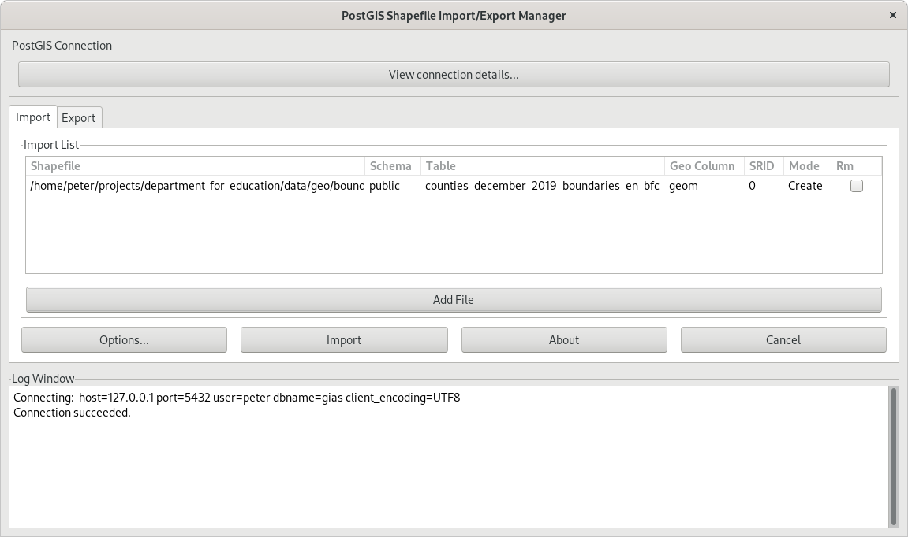
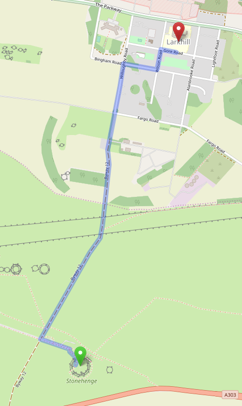
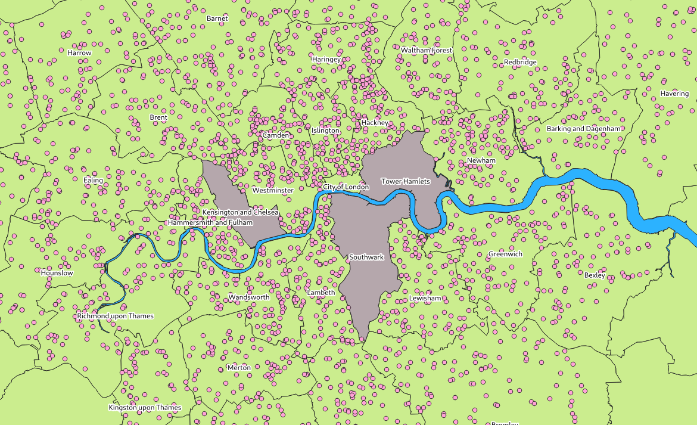

# The [Unofficial] GIAS Query Toolkit

Ever wanted quickly query the [Get Information About
Schools](https://get-information-schools.service.gov.uk/) dataset but couldn't
because it's provided in an unwieldy CSV file that's not properly-encoded and
has too many columns?

Great, you're in the right place!

This set of tools downloads and imports the data into a locally-running PostgreSQL
database and lets you take advantage of [PostGIS](https://postgis.net/) to supercharge
your queries.

## Getting up and running

### Prerequisites

* [**GNU Make**](https://www.gnu.org/software/make/), used to run the automatic download and import
* [**GNU Iconv**](https://www.gnu.org/software/libiconv/), fix file encoding
* [**GNU Wget**](https://www.gnu.org/software/wget/) for downloading the GIAS CSV file
* [**PostgreSQL**](https://www.postgresql.org/) with an local superuser account
* [**PostGIS**](https://postgis.net/) for geographic query goodness

### Running the command

To download, cleanse, import and build the data objects only a single command
should be required.

```bash
make
```

When debugging, use `make refresh` to run the import steps without repeatedly downloading
the export file.

```bash
make refresh
```

## Manual importing

The entire import, apart from file cleansing, is written in standard SQL. Executing
the statements needs to be done in the correct order, the `Makefile` is the best
place to get a feel for how it works.

## Sending this data to BigQuery

Dependencies

```
pip install bigquery-schema-generator
brew install gcloud-cli
gcloud auth login
gcloud config set project PROJECT_ID
```

The script assumes you have a `gias` dataset in your BigQuery project and a
Google Cloud Storage bucket called `rugged-abacus-uploads`.

### Uploading

First build the tables in your local database

```bash
make
```

Then run the import

```bash
make load_to_bq
```

## Tables and views

The importer creates the following database objects:

| Name                         | Type                | Description                                                        |
| ----                         | ----                | -----------                                                        |
| `schools`                    | `table`             | All schools, both open and closed                                  |
| `deprivation_pupil_premium`  | `table`             | [DPP information](https://www.gov.uk/guidance/pupil-premium-effective-use-and-accountability) broken down by school |
| `open_schools`               | `materialized view` | Only open schools                                                  |
| `regions`                    | `table`             | England's regions and associated gegoraphic information            |
| `local_authorities`          | `table`             | England's local authorities and associated gegoraphic information  |
| `establishment`              | `type`              | School types (eg. Foundation school, Free school)                  |
| `establishment_group`        | `type`              | School categories (eg. Independent Schools, Universities, Colleges |
| `gender`                     | `type`              | School gender policies (eg. Boys, Girls, Mixed)                    |
| `phase`                      | `type`              | School phases (eg. Secondary, Primary, 16 plus)                    |
| `rural_urban_classification` | `type`              | Classification of a school's setting, source links in definition   |

## FAQs

### Why use [enumerated types](https://www.postgresql.org/docs/12/datatype-enum.html) when you could've just used a `varchar`?

Efficiency aside, the main reason is to allow [ordering by _rank_ rather than
alphabetic position](https://www.postgresql.org/docs/12/datatype-enum.html#id-1.5.7.15.6).

### I want to query a column that's not included in the import, how do I add it?

1. Add your desired column to the `create` statement in `ddl/tables/create_schools.sql`. Ensure
   it is the correct datatype.
2. Then add your new column name to the list of target columns in `dml/import_schools.sql` and
   add a the corresponding column in the source data (i.e. the source CSV) to the `select` part
   of the statement. For datatypes other than `varchar`, cast appropriately with `::new_datatype`
   There are plenty of examples of casting in the file already
3. See if it worked, run `make refresh` to drop everything and re-import

### Where can I find and how do I import other geographic data?

There are plenty of great sources for educational geographic data:

* [Open Geography Portal](http://geoportal.statistics.gov.uk/)
* [Office for National Statistics](https://www.ons.gov.uk/methodology/geography/geographicalproducts/)
* [UK Data Service](https://www.ukdataservice.ac.uk/get-data/themes/education.aspx)
* [National Records of Scotland](https://www.nrscotland.gov.uk/statistics-and-data/geography/our-products/census-datasets)

Once you've found a useful dataset, select the [Shapefile](https://en.wikipedia.org/wiki/Shapefile) download option
if available. Now we can use `shp2pgsql` to import it. It comes with a GUI which makes the process very simple.



Alternatively, and more-flexibly (if the dataset you want isn't available as a
Shapefile), you can use [GDAL](https://gdal.org/)'s
[ogr2ogr](https://gdal.org/programs/ogr2ogr.html).

## Nomenclature

| Word                                                         | Definition                                                                                                                                                     |
| --------------                                               | ----------                                                                                                                                                     |
| EduBase                                                      | The old name for [Get information about schools](https://get-information-schools.service.gov.uk/) (GIAS)                                                       |
| [URN](https://en.wikipedia.org/wiki/Unique_Reference_Number) | A six-digit number used by the UK government to identify educational establishments in the United Kingdom.                                                     |

## Example queries

### "Find all the schools within 3km of [Stonehenge](https://en.wikipedia.org/wiki/Stonehenge)" 🤔

```sql
select
  os.urn,
  os.name
from
  open_schools os
where st_dwithin(
  os.coordinates,                         -- Database column that holds the school's location
  st_setsrid(
    st_makepoint(-1.826194, 51.178868),   -- Stonehenge's coords
    4326                                  -- World Geodetic System
  ),
  3000                                    -- Search radius in metres
);


┌────────┬───────────────────────────────────────────────┐
│  urn   │                     name                      │
╞════════╪═══════════════════════════════════════════════╡
│ 145545 │ Larkhill Primary School                       │
│ 143006 │ St Michael's Church of England Primary School │
└────────┴───────────────────────────────────────────────┘
```

Obligatory sense check 🧐



Looks good!

### "I'd like a percentile summary of the twenty local authorities with the lowest average [deprivation pupil premium](https://www.gov.uk/guidance/pupil-premium-effective-use-and-accountability), excluding authorities with fewer than fifteen qualifying schools" 🤭


```sql
select
    os.local_authority,
    percentile_disc(0.4) within group (order by dpp.allocation) as "P40", -- discrete percentile at 0.4 (40%)
    percentile_disc(0.5) within group (order by dpp.allocation) as "P50",
    percentile_disc(0.6) within group (order by dpp.allocation) as "P60",
    percentile_disc(0.7) within group (order by dpp.allocation) as "P70",
    percentile_disc(0.8) within group (order by dpp.allocation) as "P80",
    percentile_disc(0.9) within group (order by dpp.allocation) as "P90"
from
    deprivation_pupil_premium dpp
inner join
    open_schools os on dpp.urn = os.urn
group by
    os.local_authority
having
    count(*) > 15                                                         -- only select local authorities with more than fifteen schools
order by
    avg(dpp.allocation::decimal) asc                                      -- order by DPP allocation ascending, we want the lowest
limit
    20
;

┌──────────────────────────┬────────────┬────────────┬────────────┬────────────┬─────────────┬─────────────┐
│     local_authority      │    P40     │    P50     │    P60     │    P70     │     P80     │     P90     │
╞══════════════════════════╪════════════╪════════════╪════════════╪════════════╪═════════════╪═════════════╡
│ Rutland                  │ £13,200.00 │ £15,840.00 │ £18,480.00 │ £23,760.00 │  £43,560.00 │  £70,125.00 │
│ North Yorkshire          │ £10,560.00 │ £15,895.00 │ £25,080.00 │ £40,920.00 │  £62,645.00 │  £98,175.00 │
│ Cumbria                  │ £14,520.00 │ £20,570.00 │ £31,680.00 │ £48,620.00 │  £64,680.00 │ £118,800.00 │
│ West Berkshire           │ £19,800.00 │ £25,080.00 │ £38,280.00 │ £52,800.00 │  £74,800.00 │ £100,320.00 │
│ Windsor and Maidenhead   │ £26,400.00 │ £31,680.00 │ £43,560.00 │ £60,720.00 │  £74,800.00 │ £100,045.00 │
│ Wokingham                │ £22,440.00 │ £34,320.00 │ £43,560.00 │ £58,080.00 │  £73,865.00 │  £91,080.00 │
│ Herefordshire, County of │ £21,120.00 │ £26,400.00 │ £34,320.00 │ £50,490.00 │  £62,040.00 │ £118,800.00 │
│ Wiltshire                │ £21,120.00 │ £31,680.00 │ £44,880.00 │ £59,400.00 │  £81,840.00 │ £114,840.00 │
│ Buckinghamshire          │ £22,440.00 │ £29,040.00 │ £37,895.00 │ £47,685.00 │  £64,680.00 │ £135,465.00 │
│ Shropshire               │ £18,480.00 │ £23,760.00 │ £40,920.00 │ £62,645.00 │  £83,215.00 │ £125,290.00 │
│ Central Bedfordshire     │ £22,440.00 │ £35,640.00 │ £50,160.00 │ £63,360.00 │  £89,760.00 │ £128,095.00 │
│ Oxfordshire              │ £22,440.00 │ £30,360.00 │ £42,240.00 │ £61,380.00 │  £88,440.00 │ £134,173.00 │
│ Cheshire East            │ £19,800.00 │ £29,040.00 │ £47,520.00 │ £68,640.00 │ £100,320.00 │ £144,925.00 │
│ South Gloucestershire    │ £26,400.00 │ £34,320.00 │ £43,560.00 │ £62,040.00 │  £81,840.00 │ £136,043.00 │
│ Devon                    │ £21,120.00 │ £26,400.00 │ £44,880.00 │ £60,720.00 │  £92,400.00 │ £141,240.00 │
│ Dorset                   │ £22,440.00 │ £31,790.00 │ £47,520.00 │ £68,640.00 │  £92,400.00 │ £130,680.00 │
│ Gloucestershire          │ £23,760.00 │ £33,000.00 │ £49,060.00 │ £66,000.00 │  £96,305.00 │ £133,705.00 │
│ Leicestershire           │ £30,360.00 │ £44,880.00 │ £58,080.00 │ £71,280.00 │  £91,080.00 │ £134,640.00 │
│ Somerset                 │ £27,720.00 │ £36,960.00 │ £51,425.00 │ £72,600.00 │  £90,695.00 │ £153,120.00 │
│ Surrey                   │ £33,000.00 │ £42,240.00 │ £56,540.00 │ £75,240.00 │  £99,110.00 │ £141,240.00 │
└──────────────────────────┴────────────┴────────────┴────────────┴────────────┴─────────────┴─────────────┘
```

Try doing that in Excel 😅

### "List all the currently-open schools in London excluding those in Kensington and Chelsea, Southwark, and Tower Hamlets" 🤨

```sql
with local_authorities_to_exclude as (
  select
    st_union(la.edge) as edges               -- union multiple edges into a single geometry
  from
    local_authorities la
  where
    name in (
      'Kensington and Chelsea',
      'Southwark',
      'Tower Hamlets'
    )
)
select
  distinct on (urn)
  os.urn,
  os.name,
  os.coordinates
from
  open_schools os
inner join                                   -- join on region containing coordinates
  regions r
    on st_contains(
      r.edge,
      os.coordinates::geometry
    )
inner join                                   -- exclude the named LAs from above
  local_authorities la
    on not st_contains(
      (select edges from local_authorities_to_exclude),
      os.coordinates::geometry
    )
where
  r.name = 'London'
;
```

There are too many results to list, but here's a screenshot displaying the results in
[QGIS](https://qgis.org/). Note that QGIS fully supports PostGIS, all queries that
include a geospatial column can be displayed and manipulated by the software and used
to [create reports](https://docs.qgis.org/3.10/en/docs/user_manual/print_composer/create_reports.html) or
perform [advanced queries](https://www.qgistutorials.com/en/docs/performing_spatial_queries.html).


